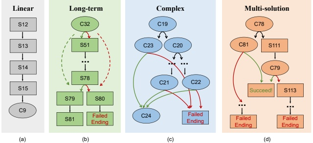

## 4 Dataset Construction

### 4.1 Overview

To evaluate long-term memory (LTM) capabilities of large language models (LLMs), we construct a narrative dataset based on the interactive fiction game The Invisible Guardian, encompassing 311 scene nodes and 86 choice nodes as captured in our structured JSON format.

We chose to use an interactive fiction game as the basis for our dataset rather than synthetic data or real-world data for several reasons. First, it is arguable that all publicly available benchmark test cases might occasionally be included in LLM pre-training data [Liu et al., 2024]. Consequently, to mitigate potential data overlap issues, we opted to independently construct a dataset of interactive fiction games. Second, synthetic data is often overly simplistic and lacks the nuanced coherence of real human narratives [Hao et al., 2024]. It relies on predefined templates, resulting in repetitive scenarios that fail to capture the complex interdependencies crucial for evaluating long-term reasoning. In contrast, the interactive fiction game The Invisible Guardian offers a rich, evolving storyline that naturally tests long-term dependencies. Third, real-world data is messy and difficult to control [Xie et al., 2025, Behr et al., 2025]. It is influenced by numerous external factors, making it hard to isolate causal relationships and define clear “success” or “failure” paths. The structured and controlled environment of an interactive fiction game provides a clear framework for evaluating long-term memory and decision-making in a repeatable manner.

Our design incorporates several distinctive features for evaluating LTM. First, unlike conventional QA or dialogue datasets that consist of isolated or short-context samples, our dataset presents a continuous and evolving story world that unfolds over multiple interactive turns, offering a naturalistic setting for evaluating long-horizon reasoning. Second, many long-term choices depend on events or facts introduced several turns earlier, thereby testing models' long-term dependency tracking. Third, the story dynamically evolves based on the model's choices, allowing branching into different paths, including success or failure endings. Fourth, the benchmark reflects realistic decision-making complexity: consecutive choices are often interdependent, requiring models to maintain logical consistency across transitions. Finally, the dataset is multi-solution: multiple choice paths may lead to successful conclusions, emphasizing adaptability rather than rigid answer matching.

### 4.2 Structural Organization

The dataset is organized as a directed acyclic graph (DAG) composed of two types of nodes: scene nodes, which represent narrative fragments, and choice nodes, which define branching decision points. Edges denote transitions between these nodes, forming a tree-like structure that allows non-linear progression through the story. This organization not only captures the dynamic and interactive nature while enabling clear tracing of causal dependencies but also allows flexible nuanced evaluation of LTM in knowledge retention and sequential reasoning.

 $ ^{*} $ Cn:Choice_n, Sn:Scene_n.

(c)

(d)

Figure 3: Four typical patterns illustrating dataset structure complexity.

