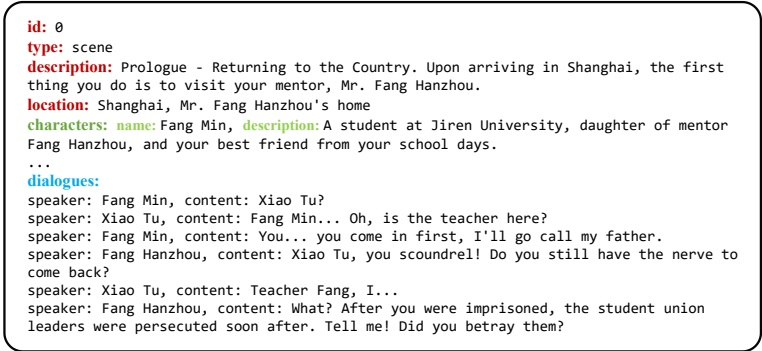
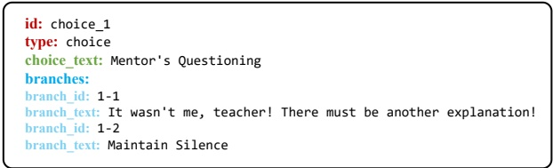

To illustrate the complexity and diversity of our dataset's structure, we categorize representative graph patterns in Figure 3. These include (a) linear chains of scenes, testing narrative understanding and short-range memory; (b) long-term dependencies, where early events influence distant outcomes; (c) clusters of interdependent decisions, reflecting complex causal reasoning; and (d) multi-solution branches, where multiple paths can reach valid endings.

### 4.3 Data Source and Annotation Process

We construct our dataset based on the interactive fiction game The Invisible Guardian from the game's prologue to Chapter 5 by far. Manual annotation preserves the game's branching logic and causal relationships, ensures chronological ordering with memory checkpoints, and annotates metadata on transitions, dynamics, and ethics to retain sequential depth for evaluating LLMs' long-term reasoning. All content is meticulously transcribed from the original game, encompassing dialogues, narrative descriptions, character interactions, and player decision points, with each entry structured as a JSON object annotated with granular details according to its type. Scene nodes (311 entries) include unique identifiers, location, characters with descriptive attributes, sequential dialogues with speaker labels, and flags for narrative endings (where applicable), such as ending (Figure 4). Choice nodes (86 entries) feature unique identifiers, decision context descriptions, and branching options with distinct IDs and text (Figure 5).

Figure 4: Scene node example with character descriptions, dialogues, and other details.

Figure 5: Choice node example with choice text, branches, and other details.

